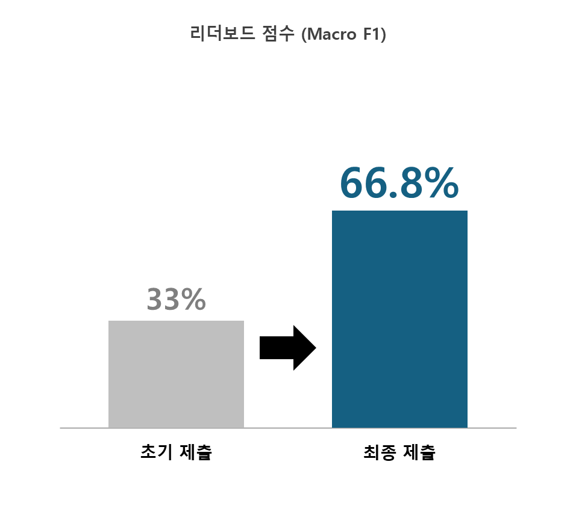
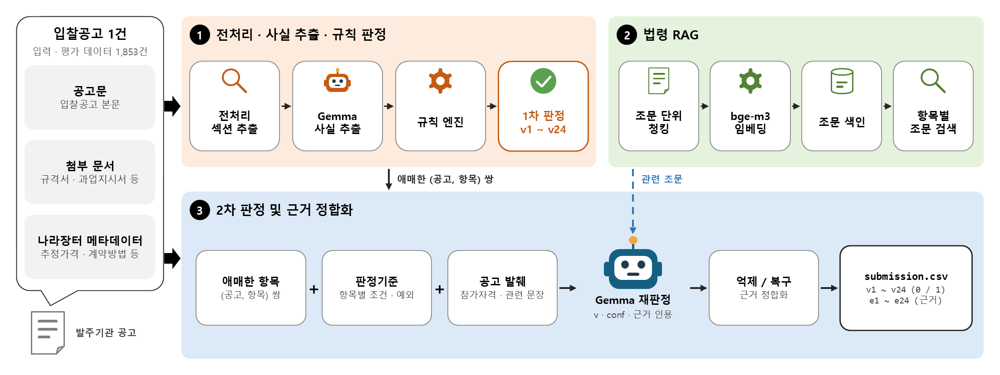

# KONEPS Legal Violation Monitoring AI Competition – LLM Fact Extraction + Rule Engine + Legal RAG

## 프로젝트 소개 & 주요 성과
[나라장터 자체입찰 공고 법령 위반사항 모니터링 AI 경진대회](https://dacon.io/competitions/official/236754/overview/description) (AI Competition for Monitoring Legal Violations in KONEPS Self-Procurement Bid Announcements)에 참가하여, 입찰공고 1건에서 **24개 검토 항목의 법령 위반 여부(0/1)와 근거 문구**를 출력하는 추론 파이프라인을 개발한 코드를 공유합니다.

- `script.py`는 평가 서버에서 자동 실행되는 제출 코드입니다. **LLM에게 위반 여부를 직접 묻지 않고 공고문에서 사실(fact)만 추출**하게 하고, 법정 금액 임계값·예외·부재탐지 판정은 **파이썬 규칙 엔진**이 결정합니다.
- 법령 패키지를 **조문 단위로 청킹**하고 bge-m3로 임베딩한 **법령 RAG**로 항목별 관련 조문을 찾아, 규칙만으로 애매한 경우에 한해 수행하는 **2차 판정** 프롬프트에 넣습니다.
- `model/policy_margin.json`은 2차 판정 결과를 규칙 결과와 어떻게 결합할지(억제/복구) 항목별로 정한 정책 파일입니다. dev 200건과 자가 라벨링 데이터로 검증한 항목만 남겼습니다.

### 최종 성과
리더보드 점수(Macro F1)를 **0.33 → 0.668** 로 향상시켰으며, 전체 1,177명 중 **195위(상위 17%)** 를 기록했습니다.

<p align="center">
  
</p>

---

## 과제 개요
- **주제**: 나라장터 자체입찰 공고의 법령 위반사항 판정 및 판단 근거 제시 (주최: 행정안전부·한국지능정보사회진흥원 / 주관: 조달청 / 운영: 데이콘)
- **입력**: 입찰공고 1건 — 공고문·첨부 문서(규격서, 과업지시서, 제안요청서 등) 텍스트와 나라장터 등록 정보(메타데이터 21개 필드)
- **출력**: `submission.csv` 49열 — `id`, 위반 여부 `v1`~`v24`(0/1), 근거 문구 `e1`~`e24`(원문의 부분문자열)
- **평가**: Macro F1 (24개 항목별 위반 클래스 F1의 단순 평균), 평가 데이터 1,853건
- **제약**
  - 고정 LLM `google/gemma-4-26B-A4B-it`과 보조 임베딩 모델 `BAAI/bge-m3`만 사용 (파인튜닝·가중치 제출 불가)
  - 라벨이 달린 학습 데이터 없음 (무라벨 공고 20,000건 + 라벨 예시 dev 200건, 자가 라벨링 허용)
  - 코드 제출 방식: 평가 서버에서 인터넷이 차단된 채 2시간 안에 추론 완료

---

## 리포지터리 구성
```
KONEPS_Legal_Violation_Monitoring_AI_Competition/
├── script.py              # 제출 코드 (전처리 · 사실 추출 · 규칙 엔진 · 법령 RAG · 2차 판정 · 근거 정합화)
├── requirements.txt       # 법령 RAG용 추가 패키지 (sentence-transformers, numpy)
├── model/
│   └── policy_margin.json # 2차 판정 결합 정책 (항목별 억제/복구 기준)
├── assets/                # README용 다이어그램
├── .gitignore / LICENSE
└── README.md
```

---

## 기술 스택
- **언어**: Python 3.12
- **LLM 추론**: vLLM offline API, JSON Schema 기반 구조화 출력(structured outputs), int8 양자화 로드
- **검색**: sentence-transformers(`BAAI/bge-m3`), numpy 코사인 유사도
- **규칙 엔진·전처리**: 정규식, 표준 라이브러리 (`re`, `json`, `csv`, `unicodedata` 등)

---

## 데이터셋
대회 데이터(무라벨 공고 20,000건, dev 200건과 라벨, 항목표, 법령 패키지, baseline 등)는 대회 규정상 재배포할 수 없어 **리포지터리에 포함되어 있지 않습니다.** [대회 페이지](https://dacon.io/competitions/official/236754/overview/description)의 데이터 탭에서 내려받아야 합니다.

> **주의:** 본 리포지터리는 **코드 공유 목적**으로 유지됩니다. `script.py`는 대회 baseline의 입출력 규약(데이터 로더, CSV 형식 검증 등)을 따르며, 실행하려면 대회 데이터와 고정 모델을 로컬에 준비해야 합니다.

---

## 파이프라인 구조 및 동작 흐름

<p align="center">
  
</p>

1. **전처리 · 섹션 추출**
   - 메타데이터에서 추정가격 구간, 적용 계약법(국가/지방), 계약·낙찰 방법, 중소기업자간 경쟁제품 여부를 계산합니다.
   - 공고문에서 참가자격, 공고 개요, 공동수급, 설명회, 제출서류, 규격 관련 문장만 발췌해 프롬프트 길이를 줄입니다.
2. **LLM 사실 추출 (공고당 1회 호출)**
   - Gemma가 JSON Schema 구조화 출력으로 사실 항목(실적 요구 여부와 금액, 지역 제한 단위, 기업 규모 제한, 직접생산확인 요구 등)과 근거 인용문을 추출합니다.
   - 인용문은 원문을 글자 그대로 복사하도록 지시하고, 추출 실패에 대비해 정규식 기반 사실을 함께 만들어 둡니다.
3. **규칙 엔진 (1차 판정)**
   - 추출된 사실에 법정 기준을 적용해 `v1`~`v24`를 결정합니다. 예: 고시금액(2억 3천만 원), 지방 지역제한 상한(5억 원), 1억 원 경계, 공동수급 최소지분율(국가 10% / 지방 5%), 협상계약 설명회 기간(40일 / 20일 / 10일).
   - "있어야 할 기재가 없는 것"이 위반인 부재탐지 항목(10·11·16·18·20번)과 소액수의·수의계약 예외도 규칙으로 처리합니다.
4. **법령 RAG**
   - 법령 패키지를 조문·장·절·별표 단위로 청킹하고, 항목표의 조문 인용을 해당 조문으로 직접 매핑한 뒤 bge-m3 의미 검색으로 보강합니다.
   - 검색은 공고마다 하지 않고 항목 × 법령체계(국가/지방)별로 한 번만 계산해 실행 시간을 아낍니다.
5. **2차 판정**
   - 규칙이 위반으로 본 항목(억제 검증)과 약한 단서만 있는 항목(복구 후보) 중 정책이 있는 (공고, 항목) 쌍만 다시 묻습니다.
   - 프롬프트는 항목별 판정기준·예외, 관련 조문, 공고 발췌로 구성하고, Gemma는 `{위반 여부, 신뢰도, 근거 인용}`을 반환합니다.
6. **정책 결합 · 근거 정합화**
   - `policy_margin.json`의 항목별 기준을 넘는 판정만 규칙 결과를 뒤집습니다(억제/복구). 복구는 인용문이 원문에 실제로 있을 때만 적용합니다.
   - 근거 문구는 원문 부분문자열로 복원하고 500자로 자른 뒤, 부재탐지 항목은 공란으로 둡니다.

**안전장치**: 모델을 올리기 전에 규칙 기반 임시 답안을 먼저 저장하고, 실행 시간을 추적해 제한 시간에 가까워지면 남은 공고는 규칙 결과로 마감합니다. 어느 단계에서 실패해도 제출 파일이 남습니다.

---

## 검증 방법과 배운 점
- **LLM 추출과 규칙 적용의 분리**: GPU 환경에서 뽑은 사실을 캐시(`--dump-facts`)해 두고, 규칙만 바꿀 때는 캐시를 재생(`--facts`)해 GPU 없이 평가했습니다.
- **검증된 정책만 유지**: dev 200건만 보고 추가한 2차 판정 정책이 리더보드 점수를 떨어뜨린 뒤(0.6596 → 0.6511), dev 200건과 자가 라벨링 데이터 양쪽에서 효과가 확인된 항목만 정책에 남기는 원칙을 세웠습니다.
- **dev와 평가 데이터의 분포 차이**: dev 200건은 항목별 위반 사례가 고르게 들어가도록 구성되어 평가 데이터의 분포를 대표하지 않습니다. 그래서 dev Macro F1(0.887)과 리더보드 점수(0.668)가 크게 달랐고, 드문 항목에서는 오탐 한 건이 F1을 크게 깎았습니다. 무라벨 데이터의 항목별 발화율로 평가 분포를 추정해 채택 여부를 판단하는 보조 지표를 만들어 썼습니다.

---

## 사용 방법
1. **환경 구성**
   ```bash
   pip install -r requirements.txt   # vllm · torch · transformers 는 평가 서버 고정 패키지
   ```
2. **데이터·모델 준비**
   - 대회 데이터 탭의 `data/` 폴더(항목표, 법령 패키지 등)와 입력 JSONL을 준비합니다.
   - 경로는 환경변수 `PPS_DATA_DIR`, `PPS_OUTPUT_DIR`, `PPS_MODEL_DIR`, `PPS_EMBED_DIR`로 지정합니다.
3. **흐름 확인 (모델 없이)**
   ```bash
   python script.py --mock --input dev.jsonl --data-dir ./data
   ```
4. **규칙 엔진만 실행**
   ```bash
   python script.py --no-llm --input dev.jsonl --data-dir ./data
   ```
5. **전체 추론**
   ```bash
   python script.py --data-dir ./data --output-dir ./output
   ```
   결과는 `output/submission.csv`에 저장되며, 저장 후 열 수·행 수·id·값 범위·근거 문구 길이를 자가 검증합니다. `--no-judge`로 2차 판정을 끌 수 있습니다.

---

## 실험 가능 여부 체크
- **가능**: 대회 데이터를 준비하면 `--mock`, `--no-llm` 모드로 GPU 없이 흐름과 규칙 엔진을 확인할 수 있습니다. 전체 추론은 고정 LLM을 올릴 수 있는 GPU(평가 서버 기준 NVIDIA L40S)가 필요합니다.
- **불가능**: 데이터가 없는 상태에서는 실행할 수 없습니다. (리포지터리는 코드 공유 목적)

---

## 핵심 결과
- **리더보드 Macro F1**: `0.668` (평가 데이터 1,853건)
- **순위**: 1,177명 중 195위 (상위 17%)
- **로컬 검증**: dev 200건 Macro F1 `0.887`
- **구현 특징**: LLM 사실 추출 + 규칙 엔진 + 법령 RAG 기반 2차 판정 / 근거 문구는 항상 원문 부분문자열 / 제한 시간 대응 안전장치

---
